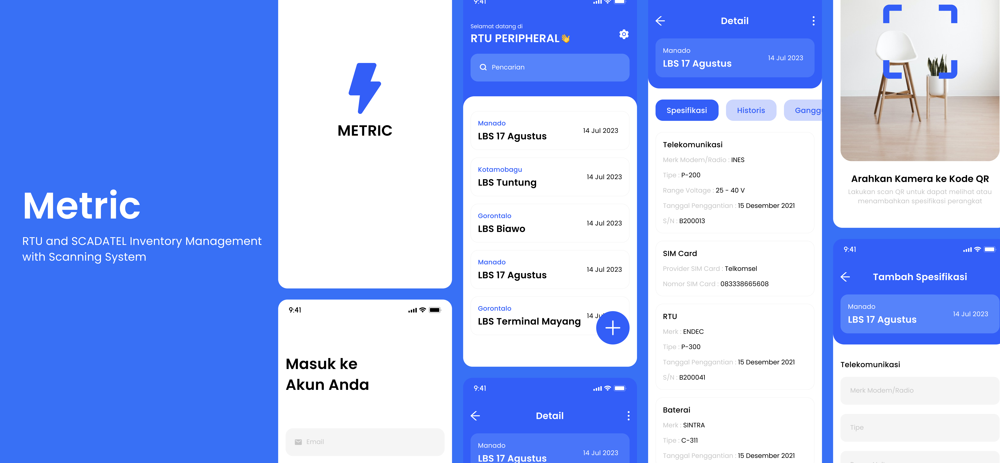

<!-- git remote add origin https|ssh:path/to/the/repository.git  -->
<!-- git pull origin main --rebase -->

<h1> Metric - RTU and SCADATEL Management App with Scanning System </h1>

<!-- You can make badge by read on official documentation at https://shields.io/badges -->

<!-- 

 -->

<a href="#-introduction">Introduction</a> &nbsp;&bull;&nbsp;
<a href="#-tech-stack">Tech Stack</a> &nbsp;&bull;&nbsp;
<a href="#%EF%B8%8F-installation">Installation</a> &nbsp;&bull;&nbsp;
<!-- <a href="#%EF%B8%8F-demo">Demo</a> &nbsp;&bull;&nbsp; -->
<a href="#-reference">Reference</a>&nbsp;&bull;&nbsp;
<a href="#-issue">Issue</a>&nbsp;&bull;&nbsp;
<a href="#-license">License</a>&nbsp;&bull;&nbsp;
<a href="#-author">I Putu Krisna Erlangga</a>

## 📄 Introduction

This application was developed to improve the efficiency and performance of UP2D Sulutenggo in managing RTU and SCADATEL units. Previously, data was viewed and processed through Microsoft Excel. However, with the increasing number of RTU and SCADATEL units, this approach became very difficult and inefficient. Additionally, issues with observing historical data made it challenging to perform necessary maintenance on each unit.

To address this, my team and I developed `Metric`, an application designed to assist users in managing RTU and SCADATEL data. The application includes a scanning system to allow users to quickly and securely access information. To facilitate monitoring, the application also provides current and historical RTU and SCADATEL data in PDF and Excel formats, which can be automatically downloaded to the user's device.

## 💻 Tech Stack

> Framework, Library, Database, Tools, etc

<!-- You can search the logo with https://simpleicons.org and copy the name in logo=copyhere same with color after badge/YourText-YourColor-->

- [Clean Architecture](https://developer.android.com/topic/architecture)
- [Hilt Dependency Injection](https://developer.android.com/training/dependency-injection/hilt-android)
- [Retrofit](https://square.github.io/retrofit/)
- [Room](https://developer.android.com/training/data-storage/room/)

## ⚙️ Installation

1. Clone this repository `git clone https://github.com/zer0-911/readme-project-template.git` or click `Clone or Download` button and then click `Download ZIP`
2. Open this project in Android Studio
3. Make sure your Android Virtual Device (AVD) is already activated
4. Run the app

<!-- ## 📽️ Demo

<!-- If Needed  -->
<!-- 

    

 -->

## 📚 Reference

<!-- If Needed -->

- [Google](https://www.google.com)

## 🚩 Issue

If you found a bug or an issue, please report by opening a new issue on [this repository](https://github.com/zer0-911/paper-drone/issues).

## 📝 License

This project is licensed under the **MIT** License - see the [LICENSE](LICENSE) file for details

## 📌 Authors

<h3> I Putu Krisna Erlangga </h3>

